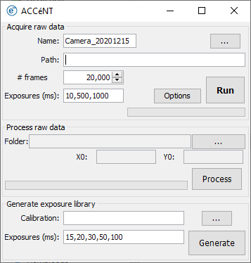

# Micro-manager 2 guide

### Prerequisite

- Micro-Manager 2.0.0-gamma

- Camera compatible with Micro-Manager

- ACCéNT plugin installed

  

ACCéNT can be started from the "Plugins" menu of Micro-Manager, under the "Acquisition Tools" section. It has three steps, which can be performed together in a pipeline or independently.

## Acquisitions

In order to calibrate the camera, one need to acquire at least two datasets with different exposures. The ACCéNT plugin requires the following parameters:

- **Experiment name**: the field is automatically filled with the camera name and the date, but can be changed by modifying the field.

- **Path for data saving**: use the "..." button to locate a folder in which to save the acquisitions.

- **Number of frames**: we recommend using **at least 15'000 frames**.

- **Exposures in ms**: comma-separated exposures at which to acquire the frames. We recommend using **at least 3 exposures** with a wide range of values (e.g.: 10, 300, 1000). 

- **Options**: see below

  

#### Acquisition options

By clicking on "Options", you can access the acquisition options panel. It allows users to modify the following parameters:

- **Pre-run time in minutes**: in order to obtain reliable data, it is beneficial to run the camera without recording the images first. The number of frames in pre-run is calculated from the exposure times and the pre-run time, but will likely be longer than expected. The reason is that changing the exposure time in between frames often results in overhead. 
- **Save frames as tiff stacks or single images**
- **Process data in parallel or separately**: if the "in parallel" option is selected, the frames will be processed as they are acquired. At the end of the acquisition, the processing will automatically finish the calibration and save the results. If "separately" is selected, the images will be saved to the disk, but the processor will not run until users click on "processing".
- **Roi**: users can define here a region of interest to which the images should be cropped. Note that if no roi is set, the acquisition will be full-frame.

If options are not specifically set, they will be equal to the defaults (1 min pre-run, tiff stacks, in parallel processing and full camera chip).

#### Acquisition

Once all the parameters have been set, the different exposures can be acquired by pressing "Run". The progress of the experiment is displayed by a progress bar and a text indicating the number of frames in pre-run and of acquired frames. The acquisition produces a folder per exposure with names ending by "XXXms" where XXX is the exposure time in ms. In addition, it also creates a roi.roi file in which the acquisition roi is saved.

**Important notes**:

- **Pre-run time**: often, the effective pre-run time takes longer than what is set in the options. The reason is that the number of frames to acquire in pre-run is estimated from the exposures and the required pre-run time. However, changing the exposure time in between frames yields an extra overhead that is not known before acquiring.

- **Crash if acquisition speed >> processing speed**: if the acquisition is too fast for the processor, the memory will fill up and the program might crash (memory heap exception). In such a case, restart the acquisition, albeit with the "**separately**" processing option selected.

- **Roi**: the acquisitions are performed according to the Roi set in the options and does not take into account any Roi set in the main window of Micro-Manager.

- **Acquisition time**: acquisitions can be very lengthy and can easily reach more than 10h.

  

## Processing

The processing can be run in parallel to the acquisition or separately. It does not require any parameters but the folder where the images have been saved and the roi. The roi.roi file created at the start of an acquisition is automatically loaded. However, if the file was lost, users can set the roi manually. The processor produces multiple files:

- Average and variance images for all processed exposures.
- The maps for the gain, baseline, dark current per second, the square read-noise, the square thermal noise per second and the coefficient of determination for the gain, average and variance fits.
- A calibration file (.calb) which contains the values of all maps and of the roi.

**Important notes**:

- **Micro-Manager acquisitions**: the processor expects images acquired with Micro-Manager, there is no guarantee that it would work with images acquired with another software (it probably won't).

- **Number of acquisitions**: the processor requires **at least 2 folders** in the path. 

- **Folder naming convention**: the acquisition folders must contain the **exposure time followed by "ms" at the end of their name**.

- **Roi width and height**: they are purely indicative and are in effect not used. Roi width and height are extracted from the calibration images themselves.

  

## Generation

Generation of average and variance maps are performed automatically at the end of the processing. Additional generation can be done anytime by selecting the path to a calibration file, entering the required exposures in ms and finally clicking on "generate".

Generation produces an expected average and variance images for each indicated exposure time.